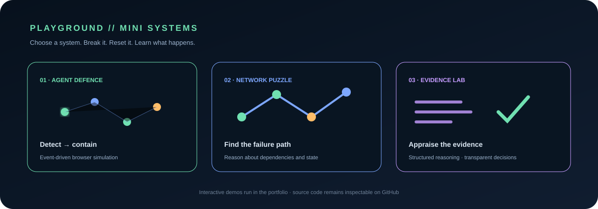

# Anne Beth Andersen

**Developer · Cloud & automation · Data · Evidence-oriented software**

I build practical software at the intersection of **technology, healthcare, research and automation** — with an emphasis on systems that are understandable, testable and inspectable.

  

  <a href="https://abla86.github.io/developer-portfolio/">Portfolio</a> ·
  <a href="https://github.com/abla86?tab=repositories">Repositories</a>

## PLAYGROUND — don't just read the profile

  

**Want to play?** The profile is the launchpad; the working simulations live in the portfolio so they can use real HTML, JavaScript and interaction instead of pretending a GitHub README can execute application code.

- **[Agent Defence — play the simulation](https://abla86.github.io/developer-portfolio/#interactive-engineering-lab)** — start monitoring, inject a simulated threat and watch containment.
- **[Network State — explore the system](https://abla86.github.io/developer-portfolio/#interactive-engineering-lab)** — inspect the live node/state visualization.
- **[Evidence Lab — open the application](https://abla86.github.io/developer-portfolio/)** — explore the research-oriented software work.

> **GitHub limitation:** README content cannot safely run arbitrary JavaScript. The profile therefore shows the games visually and launches the real interactive versions on the GitHub Pages application.

## The system behind the projects

The projects are not intended as a collection of unrelated demos. The common thread is building **inspectable systems** where domain knowledge, software engineering, data and evidence can connect without hiding the boundaries between them.

| Domain | What I work with |
|---|---|
| **Software** | React, TypeScript/JavaScript, Python, C#/.NET, APIs |
| **Cloud & platform** | Azure, Docker, Kubernetes, IaC, CI/CD |
| **Data & automation** | SQL, analysis workflows, automation and tooling |
| **Evidence & research** | appraisal, traceability, structured research workflows |
| **Security-minded engineering** | DevSecOps, dependency controls, resilience and controlled demonstrations |
| **Healthcare** | software and data problems grounded in a real clinical domain |

## Selected public work

### Evidence Appraisal Tool
Research-support software for structured evidence appraisal and research workflows, with explicit separation between **software verification** and **methodological validity**.

[View repository →](https://github.com/abla86/evidence-appraisal-tool)

### Azure Kubernetes Showcase
A cloud-engineering project demonstrating **.NET, React/TypeScript, Docker, Kubernetes, Azure, infrastructure as code, DevSecOps and observability**.

[View repository →](https://github.com/abla86/azure-kubernetes-showcase)

### Healthcare Workforce SQL
A data-focused project using SQL to explore healthcare workforce data.

[View repository →](https://github.com/abla86/healthcare-workforce-sql)

### Healthcare Data Analyzer
A focused healthcare data-analysis project.

[View repository →](https://github.com/abla86/healthcare-data-analyzer)

## Engineering standard

**Build → test → document → validate.**

- Documentation describes implemented behaviour rather than intended behaviour.
- Automated tests are used where they can establish software behaviour.
- Security and dependency controls are applied where appropriate.
- Architecture decisions, operational trade-offs, test boundaries and known limitations are documented.
- Prototype, demonstration, verified and production-ready status are kept distinct.
- Methodology-driven projects identify the relevant instrument/framework and version.
- For research-support software, **software correctness is not presented as proof of scientific, clinical or methodological validity**.

## Current direction

Building a portfolio of **full-stack, cloud, data and evidence-oriented software** that can be inspected rather than merely demonstrated through screenshots.

More work is available across my repositories; repository status should be read from each project's current documentation and implementation.

---

**Build systems that can be examined. Not just claims that can be displayed.**
