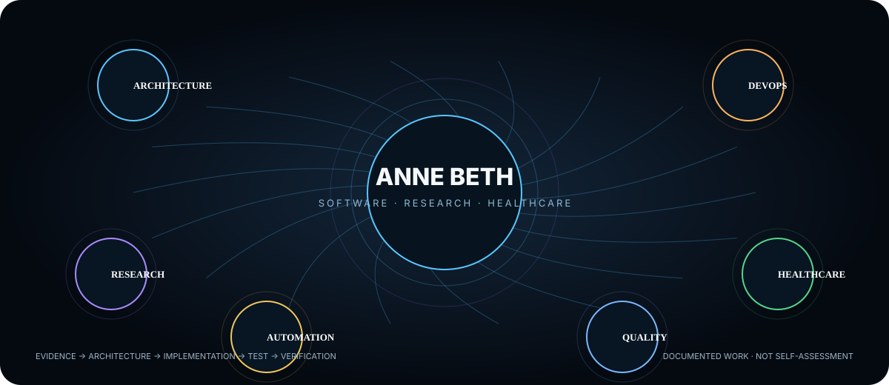
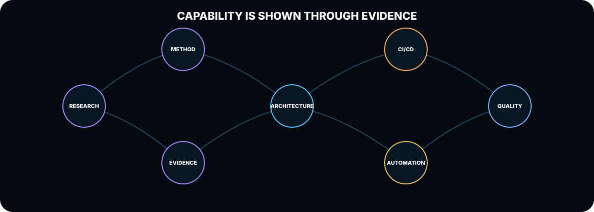
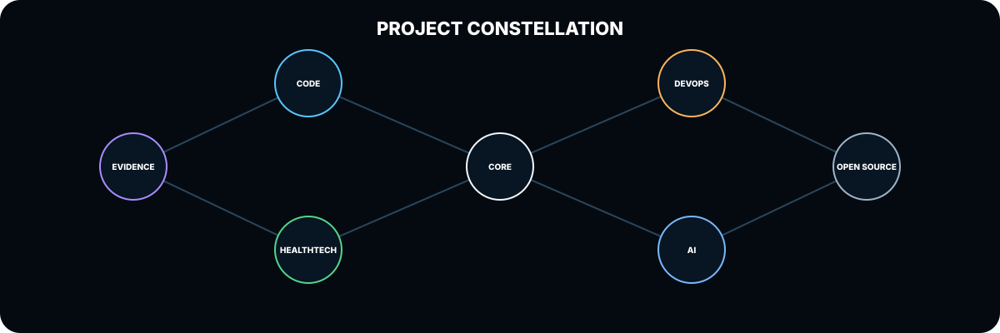
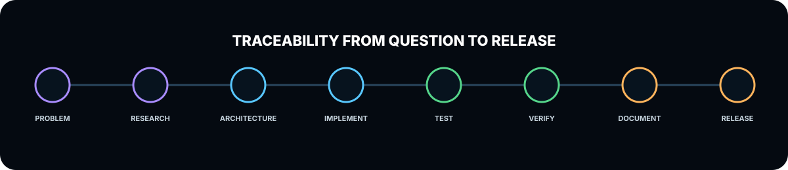

# ANNE BETH

### Software Architecture · DevOps Engineering · Research Methods · Healthcare IT

---

## THE SYSTEM

This profile is the **entry point to an interactive professional ecosystem**, not a conventional résumé page.

The central model is a **swarm intelligence network**: architecture, DevOps, research, healthcare, automation and quality engineering are connected through the work that demonstrates them.

**The profile does not score skills. It follows evidence.**

---

## EXPLORE THE NETWORK

<table>
<tr>
<td align="center" width="33%">

### ARCHITECTURE

System boundaries  
Data flow  
Design decisions  
Maintainability

[ENTER WORLD →](https://abla86.github.io/developer-portfolio/#architecture)

</td>
<td align="center" width="33%">

### DEVOPS

CI/CD  
Automation  
Builds  
Verification

[ENTER WORLD →](https://abla86.github.io/developer-portfolio/#devops)

</td>
<td align="center" width="33%">

### RESEARCH

Research methods  
Evidence appraisal  
Synthesis  
Implementation

[ENTER WORLD →](https://abla86.github.io/developer-portfolio/#research)

</td>
</tr>
<tr>
<td align="center">

### HEALTHCARE

Digitalisation  
Information flow  
Interoperability  
Responsible technology

[ENTER WORLD →](https://abla86.github.io/developer-portfolio/#healthcare)

</td>
<td align="center">

### AUTOMATION

Repository workflows  
Testing  
GitHub Actions  
Repeatability

[ENTER WORLD →](https://abla86.github.io/developer-portfolio/#automation)

</td>
<td align="center">

### QUALITY

Traceability  
Testing  
Security  
Release evidence

[ENTER WORLD →](https://abla86.github.io/developer-portfolio/#quality)

</td>
</tr>
</table>

---

## PROJECT CONSTELLATION

The ecosystem connects to the repositories where the implementation can actually be inspected.

| Evidence world | Repository |
|---|---|
| Evidence appraisal | [complete-evidence-appraisal-tool](https://github.com/abla86/complete-evidence-appraisal-tool) |
| Repository intelligence & security | [CodeSentinel](https://github.com/abla86/CodeSentinel) |
| AI-agent tracing & provenance | [AgentTrace](https://github.com/abla86/agenttrace) |
| Healthcare API | [HealthTechDeviceApi](https://github.com/abla86/HealthTechDeviceApi) |
| Workforce systems | [workforce-competence-management](https://github.com/abla86/workforce-competence-management) |
| Cloud / Kubernetes | [azure-kubernetes-showcase](https://github.com/abla86/azure-kubernetes-showcase) |
| AI full-stack engineering | [book-forge](https://github.com/abla86/book-forge) |
| Engineering experiments | [AB-Engineering-Lab](https://github.com/abla86/AB-Engineering-Lab) |

[OPEN PROJECT CONSTELLATION →](https://abla86.github.io/developer-portfolio/#projects)

---

## EVIDENCE TRAIL

The engineering model behind the ecosystem is:

**Problem → Research → Architecture → Implementation → Testing → Automated Verification → Documentation → Release**

A capability is represented by a repository, architecture decision, workflow, test, document, release or other inspectable artefact — not by a self-assigned percentage.

---

## MODES

---

### GITHUB SIGNAL

 

---

### Explore the system → [abla86.github.io/developer-portfolio](https://abla86.github.io/developer-portfolio/)

Accessibility and platform boundary

The GitHub profile is intentionally a **visual portal**, while the GitHub Pages application contains the real interaction. The README does not claim to execute JavaScript, Three.js, Canvas or React inside GitHub's own profile renderer. Motion-heavy experiences have accessible text/navigation equivalents in the Pages application.

