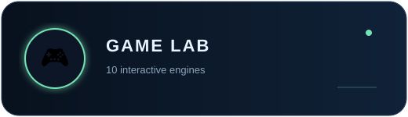
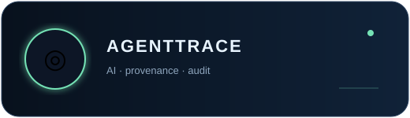
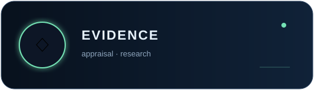
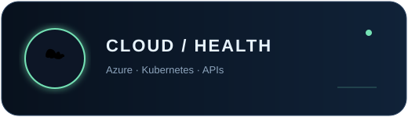

<table>
<tr>
<td width="23%" align="center" valign="middle">
  
</td>
<td width="77%" align="center" valign="middle">
  
</td>
</tr>
</table>

<table>
<tr>
<td></td>
<td></td>
</tr>
<tr>
<td></td>
<td></td>
</tr>
</table>

  <a href="https://github.com/abla86/game-lab"><b>🎮 PLAY</b></a>
  &nbsp;·&nbsp;
  <a href="https://abla86.github.io/developer-portfolio/evidence-lab.html"><b>🧬 TRY EVIDENCE LAB</b></a>
  &nbsp;·&nbsp;
  <a href="https://abla86.github.io/developer-portfolio/"><b>⚡ EXPLORE</b></a>
  &nbsp;·&nbsp;
  <a href="https://github.com/abla86?tab=repositories"><b>⌘ BUILD</b></a>

