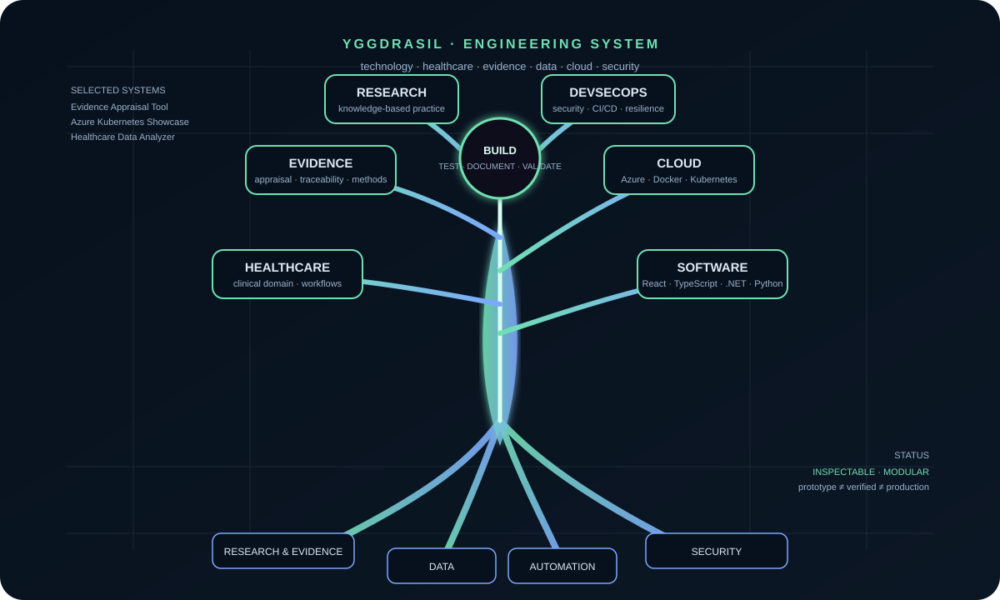

# Anne Beth Andersen

**Developer · Cloud · Automation · Data · Evidence-oriented software**

I build inspectable systems where **software engineering, healthcare, research, data and automation** meet.

  

## 🎮 PLAYGROUND

Not everything here needs to be a serious dashboard. Some things should be fun.

<table>
<tr>
<td width="50%" valign="top">

### 🛡️ Agent Defence
**DETECT → CONTAIN**

A browser-based simulation of event detection and containment.

**[▶ PLAY](https://abla86.github.io/developer-portfolio/#interactive-engineering-lab)**

</td>
<td width="50%" valign="top">

### 🕸️ Network State
**TRACE → REASON**

Watch nodes, connections and state changes move through a simulated system.

**[▶ PLAY](https://abla86.github.io/developer-portfolio/#interactive-engineering-lab)**

</td>
</tr>
<tr>
<td width="50%" valign="top">

### 🧪 Evidence Lab
**APPRAISE → DECIDE**

Explore structured evidence-appraisal software built around transparent reasoning.

**[▶ OPEN](https://abla86.github.io/developer-portfolio/)**

</td>
<td width="50%" valign="top">

### ⚙️ Engineering Lab
**BUILD → BREAK → FIX**

The portfolio contains smaller experiments too — useful for showing how I learn, test ideas and turn them into working software.

**[▶ ENTER LAB](https://abla86.github.io/developer-portfolio/)**

</td>
</tr>
</table>

## 🌳 HOW THE PROJECTS CONNECT

Yggdrasil is the map. The repositories are the branches.

| Branch | Focus |
|---|---|
| **Software** | React · TypeScript/JavaScript · Python · C#/.NET · APIs |
| **Cloud** | Azure · Docker · Kubernetes · IaC · CI/CD |
| **Data** | SQL · analysis · automation · tooling |
| **Evidence** | appraisal · traceability · structured research workflows |
| **Healthcare** | clinical domain · health technology · data |
| **Security** | DevSecOps · dependency controls · resilience · controlled demonstrations |

## 🚀 SELECTED PROJECTS

These are the projects I want a technical visitor or potential employer to see first.

### Evidence Appraisal Tool
Research-support software for structured evidence appraisal and research workflows.

**[Repository →](https://github.com/abla86/evidence-appraisal-tool)**

### Azure Kubernetes Showcase
Full-stack/cloud engineering across **.NET, React/TypeScript, Docker, Kubernetes, Azure, IaC, DevSecOps and observability**.

**[Repository →](https://github.com/abla86/azure-kubernetes-showcase)**

### CodeSentinel
Security-oriented engineering project focused on code/repository safeguards and automated controls.

**[Repository →](https://github.com/abla86/CodeSentinel)**

### RAVENTA
An independent technical project exploring a different system architecture and interaction model.

**[Repository →](https://github.com/abla86/RAVENTA)**

## 🧰 THE SMALL PROJECTS ARE STILL THERE

Calculator, digital clock, counters, Todo, task manager and other small projects are deliberately **not the headline of this profile**.

They remain useful as evidence of progression and can be explored through the portfolio/repositories.

**[Browse all repositories →](https://github.com/abla86?tab=repositories)**

## 🔬 ENGINEERING STANDARD

**Build → test → document → validate.**

- Show implementation rather than claims.
- Keep prototype, demonstration, verified and production-ready status distinct.
- Test software behaviour where tests can establish it.
- Document architecture, trade-offs, boundaries and limitations.
- Apply security and dependency controls proportionately.
- For research-support software, distinguish **software correctness** from **scientific/methodological validity**.

## CURRENT DIRECTION

Building a portfolio of **full-stack, cloud, data and evidence-oriented software** that can be inspected, tested and extended.

  <b>Don't just read the profile. Explore it.</b> 
  <a href="https://abla86.github.io/developer-portfolio/">ENTER THE PORTFOLIO →</a>

