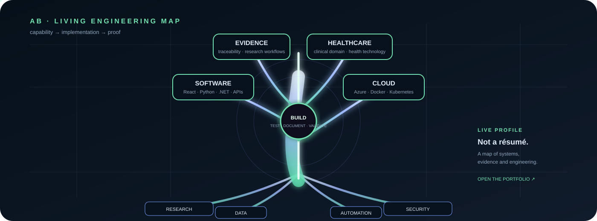

# Anne Beth Andersen

**Software · Cloud · Evidence · Healthcare**

  

  <a href="https://abla86.github.io/developer-portfolio/"><b>▶ EXPLORE</b></a>
  &nbsp;&nbsp;|&nbsp;&nbsp;
  <a href="https://abla86.github.io/developer-portfolio/game-lab.html"><b>◉ GAME LAB</b></a>
  &nbsp;&nbsp;|&nbsp;&nbsp;
  <a href="https://github.com/abla86?tab=repositories"><b>⌘ CODE</b></a>
  &nbsp;&nbsp;|&nbsp;&nbsp;
  <a href="https://github.com/abla86/agenttrace"><b>◎ AGENTTRACE</b></a>

---

## What can I build?

<table>
<tr>
<td align="center"><b>⚙ SOFTWARE</b> React · TypeScript Python · C#/.NET REST · SQL · testing</td>
<td align="center"><b>☁ CLOUD</b> Azure · Kubernetes Docker · CI/CD GitHub Actions · DevSecOps</td>
<td align="center"><b>🧬 EVIDENCE</b> Appraisal tooling Research workflows Traceability · validation</td>
</tr>
<tr>
<td align="center"><b>🏥 HEALTHTECH</b> Clinical workflows Device APIs Monitoring-oriented systems</td>
<td align="center"><b>🛡 SECURITY</b> Policy · provenance Audit · safeguards Automated controls</td>
<td align="center"><b>📊 DATA</b> Validation · analytics Automation Reproducible workflows</td>
</tr>
</table>

<b>▶ SEE IT IN CODE</b>

| Capability | Evidence |
|---|---|
| **Policy · provenance · audit** | [AgentTrace](https://github.com/abla86/agenttrace) |
| **Azure · Kubernetes · CI/CD** | [Azure Kubernetes Showcase](https://github.com/abla86/azure-kubernetes-showcase) |
| **Healthcare · .NET · APIs** | [HealthTechDeviceApi](https://github.com/abla86/HealthTechDeviceApi) |
| **Evidence appraisal** | [Complete Evidence Appraisal Tool](https://github.com/abla86/complete-evidence-appraisal-tool) |
| **Security engineering** | [CodeSentinel](https://github.com/abla86/CodeSentinel) |
| **SQL · healthcare data** | [Healthcare Workforce SQL](https://github.com/abla86/healthcare-workforce-sql) |

<b>▶ INTERACTIVE LAB</b>

**Don't just read it — interact with it.**

→ [Open the portfolio](https://abla86.github.io/developer-portfolio/)  
→ Explore interactive system maps, simulations and technical demonstrations.  
→ Jump from demonstration → source → implementation evidence.

<b>▶ ENGINEERING STACK</b>

**Frontend** · React · TypeScript · JavaScript · Vite  
**Backend** · Python · FastAPI · C# · .NET · REST  
**Data** · SQL · validation · structured analysis  
**Platform** · Azure · Kubernetes · Docker · GitHub Actions  
**Quality** · testing · linting · static analysis · DevSecOps

## How I work

**build → test → validate → document**

I distinguish what is implemented, what is demonstrated and what is verified. Claims are backed by inspectable evidence.

---

  <a href="https://abla86.github.io/developer-portfolio/"><b>LIVE PORTFOLIO →</b></a>
  &nbsp; · &nbsp;
  <a href="https://github.com/abla86?tab=repositories"><b>ALL REPOSITORIES →</b></a>

Choose a capability. Open the implementation. Follow the evidence.

